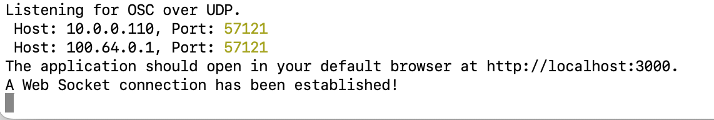

# Audio for Interlace

## Installation

Make sure yarn and node are installed. From the root run

`install` \
`yarn build`

## Running the App

run

`yarn start`

In the terminal you should see a message saying something like:

Copy the first host address and port and use these to specify the Chromatic output. This is the server that is listening for OSC messages to forward over the WebSocket to the client music application.

Running `yarn start` should also open the browser and load the Web App. You will need to configure the browser to allow audio to autoplay without user intervention. Here are the instructions for doing this in Chrome after you have launched the audio Web app:

https://championcr.com/topic/enable-auto-play/#:~:text=Mac%2C%20and%20Firefox.-,Google%20Chrome,)%E2%80%9D%20to%20%E2%80%9CAllow%E2%80%9C.

NOTE: If you can't install yarn, you might be able to use npm instead.

If you want to start the server without launching the browser, run

`yarn start:dev`